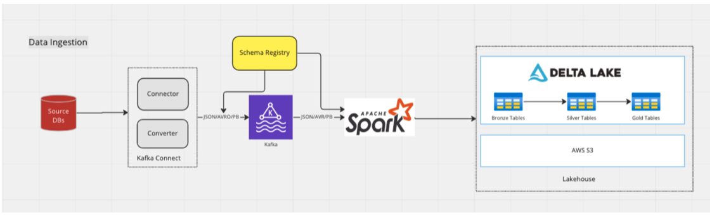
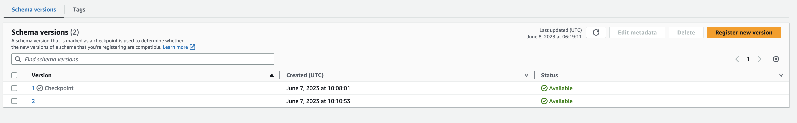
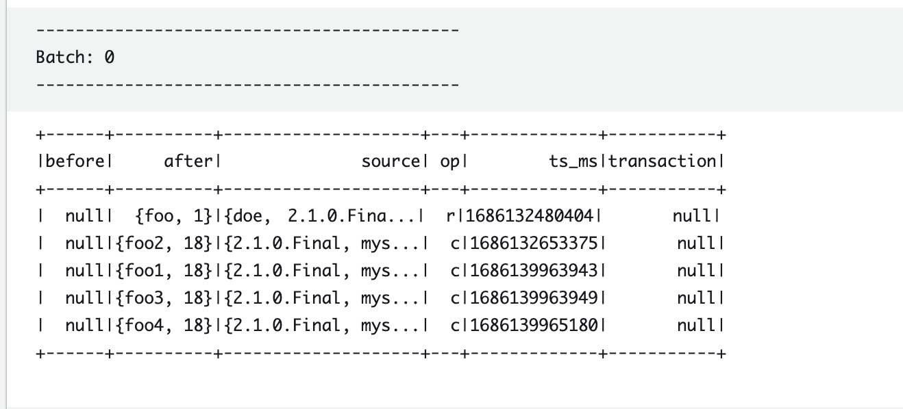
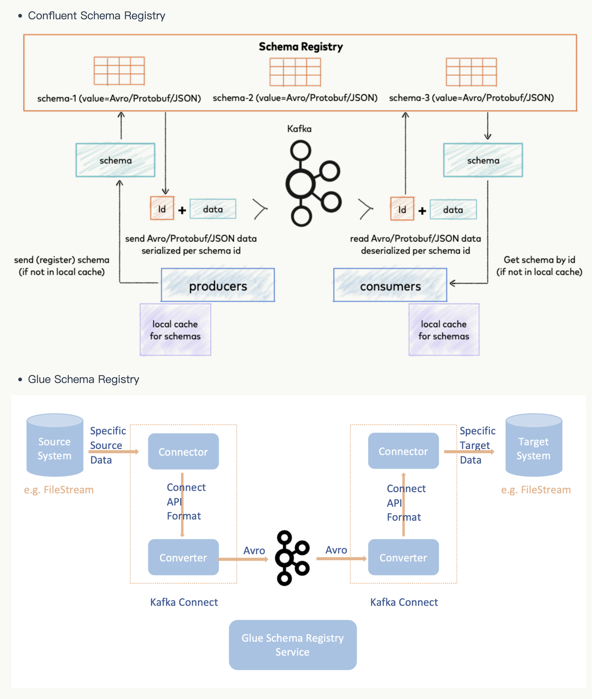

# Kafka-Connect-PoC
The solution is for deploying high reliable industry Kafka Connect HA-solution(https://strimzi.io/) solution on AWS EKS. 

## Benefits
Who needs 
- Event streaming and Lakehouse platform
- A High Available and Cloud Native Soltuion
- Kafka Connect production deployment essentials like service/process monitoring, high-availability , failover etc..

## Technical Details

### Architecture on AWS


The architecture details:
With Kafka and Kafka Connect as our event streaming foundation, it can support both batch and streaming ingestion from upstream CDC data from RDBMS as well as landing to Lakehouse. Even streaming processing, we could still run streaming pipelines in a batch-manner to best address our business needs so the overall resource required, and total cost should under the control. 

### Solution Components

In this solution, we deploy the following componnets:
- EKS Cluster
- Glue Schema Regsitry(https://github.com/awslabs/aws-glue-schema-registry)
- strimzi-cluster-operator（https://strimzi.io/blog/2020/01/27/deploying-debezium-with-kafkaconnector-resource）
- Strimzi KafkaConnect cluster
- Strimzi KafkaConnector
- MySQL RDS
- AWS MSK

### How to deploy

1. Set up MySQL and AWS MSK
2. Set up EKS [here](./resources/02-create-eks-cluster.yaml)
3. For Json: Set up the remianing resources [here](./resources/03-create-kafka-resources-json.yaml)
4. For Avro(deprecated): Set up the remaining resources [here](./resources/04-create-kafka-resources-avro-v1.yaml)
5. For Avro: Set up the remaining resources [here](./resources/04-create-kafka-resources-avro-v2.yaml)


### Schema enforcement and evolution are still in testing
-- Backward Test Case 1: 通过
```
alter table test_db.person drop column lastName;
insert into test_db.person values ('foo2', 18);
insert into test_db.person values ('foo1', 18);
insert into test_db.person values ('foo3', 18);
insert into test_db.person values ('foo4', 18);
```
We can see Glue schema registry succesfully registers the new schema without lastName in the Backward Compatability Mode


-- Backward Test Case 2: 通过
```
alter table test_db.person add column email varchar(155) null;
insert into test_db.person values ('foo1',18, 'abc');
```
-- Backward Test Case 3: 失败
```
alter table test_db.person add column address varchar(155) not null;
insert into test_db.person values ('foo1',18, 'abc', 'xyz');
```
### Glue Spark consumer
example of pyspark in Glue to consume the topic
```python
import sys
from awsglue.transforms import *
from awsglue.utils import getResolvedOptions
from pyspark.context import SparkContext
from awsglue.context import GlueContext
from awsglue.job import Job
from pyspark.context import SparkConf
from pyspark.sql.session import SparkSession
from datetime import datetime
import boto3
#from delta import *
#from delta.tables import *
from pyspark.sql.types import StructType, StructField, StringType, IntegerType, TimestampType, BinaryType
from pyspark.sql.functions import *
#import org.apache.avro.SchemaBuilder

## @params: [JOB_NAME]
args = getResolvedOptions(sys.argv, ['JOB_NAME'])

sc = SparkContext()
glueContext = GlueContext(sc)
spark = glueContext.spark_session
job = Job(glueContext)
job.init(args['JOB_NAME'], args)

glue_region = "ap-northeast-1"
glue_schema_registry_name = "legopoc"
glue_schema_name = "fullfillment.test_db.person"
glue_schema_version = "latest"

#Glue boto3 to read schema
session = boto3.Session(aws_access_key_id='xxxx', aws_secret_access_key='xxxx')
glue_client = session.client('glue' , region_name='ap-northeast-1')
response = glue_client.list_registries(
    MaxResults=23
)

schema_message = glue_client.get_schema_version(
    SchemaId={
        'SchemaName': 'fullfillment.test_db.person',
        'RegistryName': 'legopoc'
    },
    SchemaVersionNumber={
        'LatestVersion': True
    }
)


'''A buffer is allocated for the serialized message. A header of 18 bytes is
written. * Byte 0 is an 8 bit version number * Byte 1 is the compression *
Byte 2-17 is a 128 bit UUID representing the schema-version-id/'''

avro_schema = schema_message['SchemaDefinition']

def trim_gsr_avro_udf(raw_record):
    raw_record = raw_record[18:]
    return raw_record
    
spark.udf.register("trim_gsr_avro", trim_gsr_avro_udf)
trim_gsr_avro = udf(trim_gsr_avro_udf, BinaryType())


print(schema_message['SchemaDefinition'])
avro_schema = schema_message['SchemaDefinition']


df = spark \
    .readStream \
    .format("kafka") \
    .option("kafka.bootstrap.servers", "xxxx:9092") \
    .option("subscribe", "fullfillment.test_db.person") \
    .option("startingOffsets", "earliest") \
    .load()
  
df.printSchema

#df.printSchema
from pyspark.sql.avro.functions import from_avro, to_avro
newdf = df.select(from_avro(trim_gsr_avro(df.value), avro_schema).alias("data")).select("data.*")
newdf.printSchema

parquet_query = newdf \
    .writeStream \
    .format("console") \
    .start()

parquet_query.awaitTermination()

job.commit()
```

Data consumed from Topic within Glue Job output log



### Confluent Schema Registry and Glue Schema Registry Architecture
